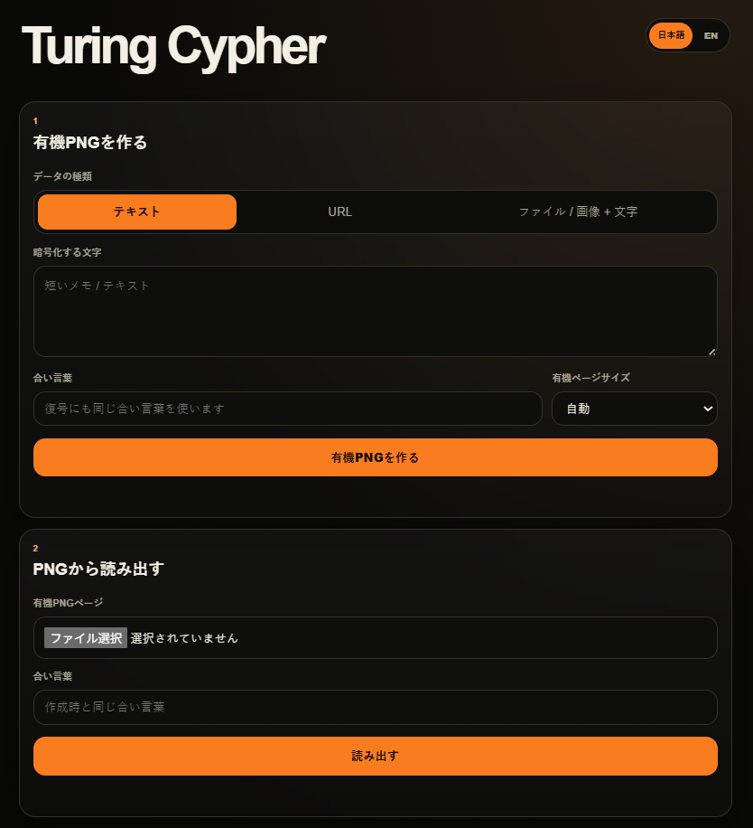

# Turing Cypher 2

**Turing Cypher 2** is an encrypted organic PNG archive.

It turns text, URLs, files, and images into one or more Gray-Scott / reaction-diffusion style labyrinth PNG files.  
The original PNG file itself acts as the container. With the same passphrase, the encoded content can be restored.

## Screenshot


<p align="center">
  
</p>

## Demo / Live App

- Cloudflare Pages: `https://turing-cypher-2.pages.dev/`

## What it does

- Encrypts text, URLs, files, or images with a passphrase.
- Packs the encrypted byte bundle into organic labyrinth PNG pages.
- Supports image + text payloads.
- Supports image optimization for smaller page counts.
- Supports large organic page sizes up to experimental ultra-large modes.
- Reads the original PNG page(s) back with the same passphrase.

## Important Concept

Turing Cypher is **not** a QR code, not metadata, and not an SNS-resistant watermark.

The encoded content is carried by the **original PNG file**.  
If the PNG is resized, recompressed, screenshot, or reposted as a social media image, the content may be lost.

Recommended sharing methods:

- original PNG file download
- ZIP download
- email attachment
- GitHub / Cloudflare / web file hosting
- Google Drive / Dropbox / iCloud / OneDrive as original files

Avoid:

- screenshots
- JPEG conversion
- X / Instagram image reposts
- LINE / Messenger photo-mode compression

## Technical Position

This is not a pure shape-only carrier.  
It is more accurately a **shape-anchored encrypted carrier**:

1. A Gray-Scott / reaction-diffusion labyrinth is generated.
2. The labyrinth structure determines carrier positions.
3. Encrypted bytes are written as subtle relative differences along the labyrinth bands.
4. The same passphrase regenerates the reference structure for reading.

The cryptographic protection comes from AES-GCM with a key derived from the passphrase.  
The labyrinth is the visual/archive carrier, not the sole source of cryptographic strength.

## Security Notes

Use a strong passphrase.

Good:

```text
tuna-river-orange-mirror-planet-needle
```

Weak:

```text
MASATO
password
1234
```

This is an artwork/prototype tool and has not been independently security-audited.  
Do not use it for critical secrets, private keys, legal evidence, or life-critical data.

## Modes

- **Text**
- **URL**
- **File / Image + Text**

Image optimization options:

- Keep original file
- Prefer 1 page
- Small
- Balanced
- High quality

When optimized, the recovered image is the optimized image, not necessarily the original file.

## Tags

```text
#PWA
#WebApp
#CreativeCoding
#GenerativeArt
#Encryption
#Steganography
#ReactionDiffusion
#GrayScott
#VibeCoding
#TuringCypher
#TuringPattern
```
